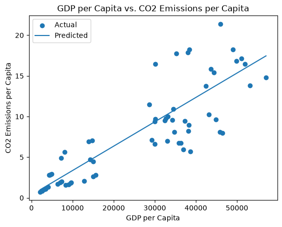
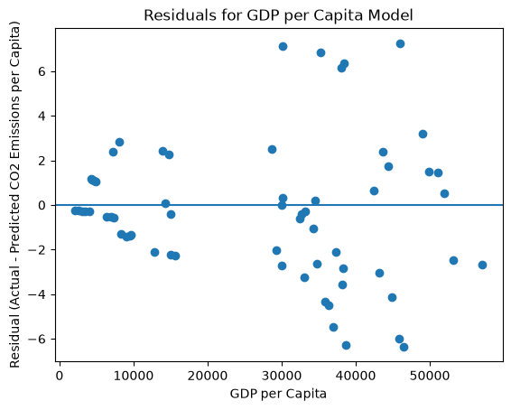

# CO2 Per Capita Prediction Explorer

[](./pyproject.toml)
[](https://docs.astral.sh/uv/)
[](https://docs.astral.sh/ty/)
[](https://docs.astral.sh/ruff/)
[](https://zensical.org/)
[](./LICENSE)

> Shalynne Orth's predictive analytics project using Python and linear
> regression to explore GDP per capita and CO₂ emissions per capita.

## Project Overview

This project uses Python and linear regression to investigate the question:

How well does GDP per person predict annual CO₂ emissions per person?

I used a subset of the Our World in Data CO₂ dataset. To compare
observations without total population size dominating the analysis,
I created a gdp_per_capita feature by dividing GDP by population.

The project prepares the data, splits it into training and test sets,
compares a linear regression model with a baseline, evaluates
prediction quality, and creates prediction and residual charts.

## Key Results

Model RMSE R-squared
Baseline 5.61 -0.009
Linear regression 3.09 0.693

The linear regression model reduced typical prediction error by about 45%
compared with the baseline. GDP per person explained about 69% of the
variation in CO₂ emissions per person in the held-out test observations.

The relationship is useful for prediction, but it does not prove that GDP
causes emissions. The residual plot shows larger errors at higher
GDP-per-capita values, suggesting that energy sources, industrial
activity, and policy could improve a future model.

## Visualization





## Run This Project

From the project root folder, run:

```powershell
uv sync
uv run python -m datafun.co2_per_capita_model
```

Close the chart windows after reviewing them. The project saves chart
images in docs/images/ and records the analysis in project.log.

## Project Files

- `src/datafun/co2_per_capita_model.py` — custom linear regression analysis
- `data/raw/owid-co2-data-subset.csv` — source data
- `docs/` — project narrative, data card, and charts
- [Project documentation](https://ShayO47.github.io/datafun-06-ml/)

## Initial Technical Modification

I changed the test-data proportion from 20% to 30% in the linear
regression workflow.

I made this change to evaluate the model using a larger set of
unseen penguin observations.

I expected the prediction metrics to change because the model would
train on fewer rows and be evaluated on more rows.

After running the project with a 30% test set, the model trained on
239 penguins and evaluated 103 unseen penguins. The baseline model
had an RMSE of 750.30 g and an R-squared value of -0.016. The linear
regression model using bill length had a lower RMSE of 591.33 g and
an R-squared value of 0.369. This means bill length improved
predictions compared with simply predicting the average body mass,
but it explains only about 37% of the variation in body mass. Other
features may improve the model.

## Standard Process

```text
OBSERVE
DECLARE
PREPARE
SPLIT
BASELINE
TRAIN
PREDICT
EVALUATE
VISUALIZE
ASSESS
```

Example:

```text
TRAIN       LinearRegression
PREDICT     on X_test
EVALUATE    baseline vs model on y_test
```

## Important Folders and Files

- **data/raw** - raw data
- **docs** - project narrative and documentation\
- **src/datafun** - supporting Python code
- **pyproject.toml** - project configuration
- **zensical.toml** - documentation configuration

## Common Workflow

Use the project instructions in `docs/project-instructions.md` to set up,
run, test, and document the project.

## Success

A successful run of the custom analysis creates `project.log`, saves
prediction and residual charts in `docs/images/`, and prints:

```shell
===================================
END main() - Executed successfully!
===================================
```

## Command Reference

The commands below are used in the workflow guide above.
They are provided here for convenience.

Follow the guide for the **full instructions**.

<details>
<summary>Show command reference</summary>

### In a machine terminal (open in your `Repos` folder)

Open a machine terminal in your `Repos` folder:

```shell
git clone https://github.com/ShayO47/datafun-06-ml

cd datafun-06-ml
code .
```

### In a VS Code terminal

These are listed for convenience.
For best results, follow the project instructions in `docs/project-instructions.md`.

Use VS Code menu option `Terminal` / `New Terminal` to open a **VS Code terminal**
in the root project folder.
Copy each command, paste into your terminal, and hit ENTER,
to run each command one at a time.

```shell
uv self update
uv python pin 3.14

uv python install
uv lock --upgrade
uv sync

uv run pre-commit install
uv run pre-commit autoupdate

git add -A
uv run pre-commit run --all-files
# repeat if changes were made by pre-commit tasks
git add -A
uv run pre-commit run --all-files

# run the custom GDP-per-capita and CO2-per-capita analysis
uv run python -m datafun.co2_per_capita_model

# do chores
uv run ruff format .
uv run ruff check . --fix
uv run ty check
uv run python -m pytest
uv run python -m zensical build

# save progress as you work
git add -A
git commit -m "your message here"
# repeat if changes were made (try the UP ARROW)
git add -A
git commit -m "your message here"

git push -u origin main
```

</details>

## Helpful Tips

- Use the **UP ARROW** and **DOWN ARROW** in the terminal
  to scroll through past commands.
- Use `CTRL+f` to find (and replace) text within a file.

## Much Can Be Ignored

- You do not need to add to or modify `tests/`.
  Tests are recommended and provided for example only.
- Many files are silent helpers. Explore as you like, but most files are never touched.
- You do NOT need to understand everything;
  let understanding build over time.

## As Needed

If VS Code does not automatically use the new `.venv` environment:

1. Open the Command Palette (`Ctrl+Shift+P`).
2. Run **Python: Select Interpreter**.
3. Select the interpreter from this project's `.venv` folder.

If VS Code still does not recognize the environment or newly installed tools:

1. Open the Command Palette (`Ctrl+Shift+P`).
2. Run **Developer: Reload Window**.

## Troubleshooting >>>

If you see something like this in your terminal: `>>>` or `...`
You accidentally started Python interactive mode.
It happens.
Press `Ctrl c` (both keys together) or `Ctrl+Z` then `Enter` on Windows.

## Documentation

- [Documentation](https://ShayO47.github.io/datafun-06-ml/)

## Data Card

- [CO2 Data Card](./docs/data-card.md)

## Annotations

- [.annotations/annotations.md](./.annotations/annotations.md)

## Citation

- [CITATION.cff](./CITATION.cff)

## License

This project is licensed under the [MIT License](./LICENSE).
